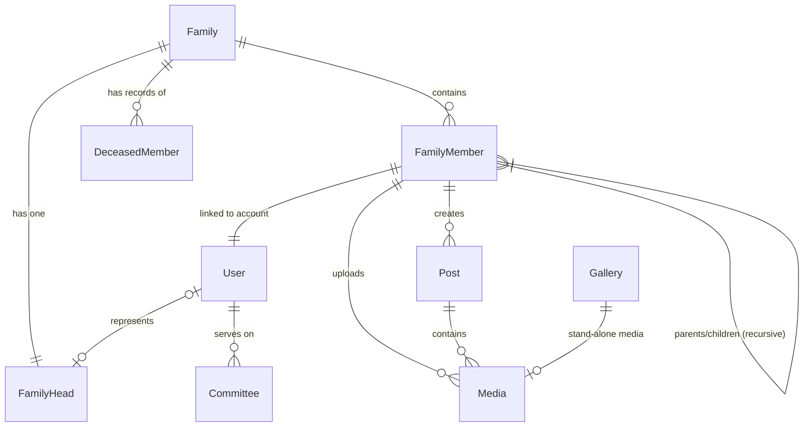

# Backend Data Relationship Map

This diagram illustrates how the different entities in the Kollamparambil Family system are connected.

## Entity Descriptions

### 1. Families & Members
- **Family**: The core unit. Every member and head belongs to a Family.
- **FamilyHead**: A specific role within a family. Can optionally be linked to a registered User.
- **FamilyMember**: Individuals belonging to a family. They can have parent/child relationships with other members.
- **DeceasedMember**: Records of family members who have passed away.

### 2. Users & Roles
- **User**: The authentication record. Linked 1-to-1 with a **FamilyMember**.
- **Committee**: Special roles assigned to Users for managing the association.

### 3. Communication & Media
- **Post**: News or Events created by a **FamilyMember**.
- **Media**: Photos or videos. They can be part of a **Post**, uploaded to a personal gallery, or exist in the global **Gallery**.
